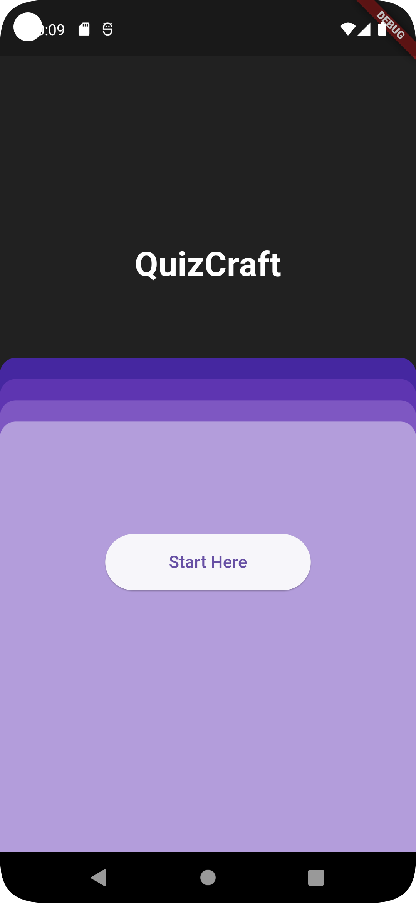
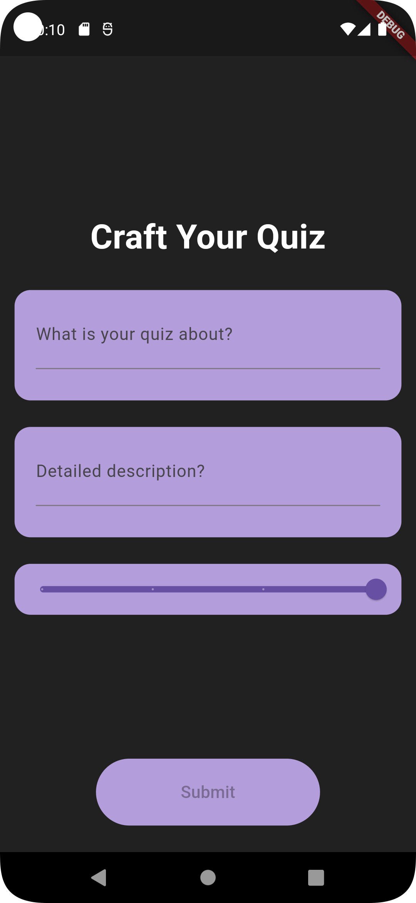
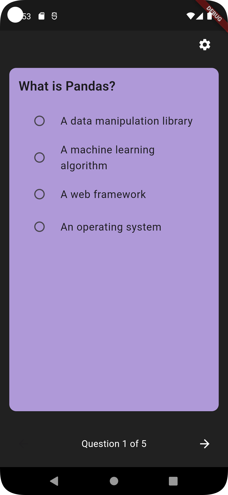
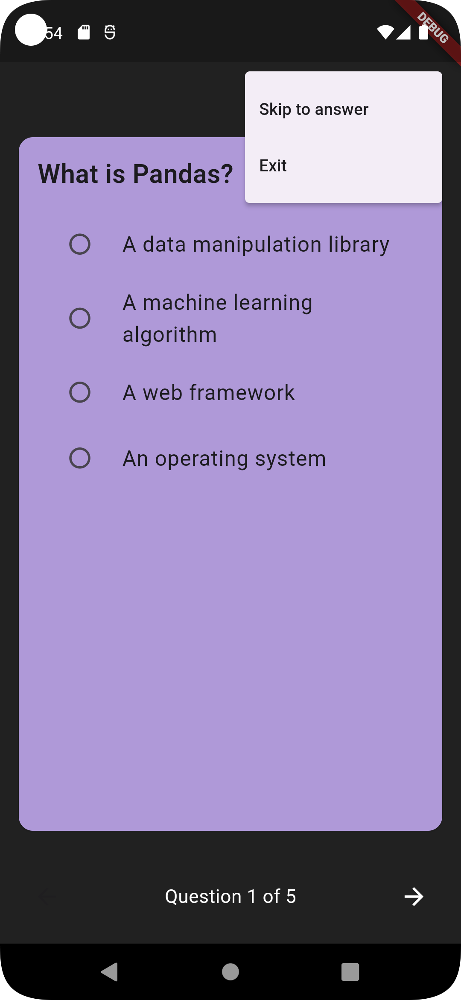
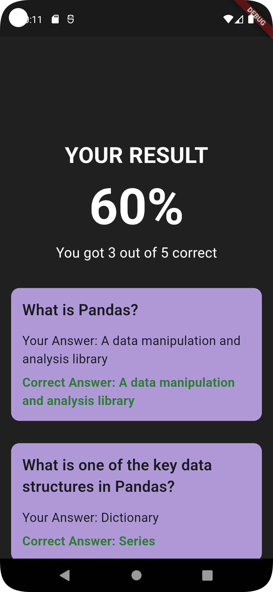
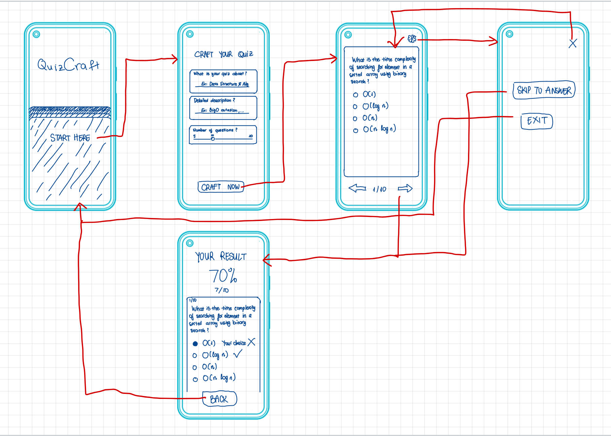

# QuizCraft

    
 
## What is the use of this Android App

This Project demonstrates the following
1. Applying Prompt Engineering in order to get detailed answer from one of Generative AI models using API
2. Processing output from AI model into desired format
3. Handling questions/options/answers and calculating result for user

## Google Store URL

### https://play.google.com/store/apps/details?id=com.cs4750.quizcraft&hl=en_IN
This URL has the application published in

## Getting Started

This project is a starting point for a Flutter application.

A few resources to get you started if this is your first Flutter project:

- [Lab: Write your first Flutter app](https://docs.flutter.dev/get-started/codelab)
- [Cookbook: Useful Flutter samples](https://docs.flutter.dev/cookbook)

For help getting started with Flutter development, view the
[online documentation](https://docs.flutter.dev/), which offers tutorials,
samples, guidance on mobile development, and a full API reference.

## Application design

### Proposed idea
This app creates quiz based on user’s query, the questions will be created by ChatGPT by OpenAI GPT API, and will be processed and displayed in the app, then the result will displayed the correct answers and explanations.

### Proposed wireframe

### Components

1. **entry_screen** Component : This Component displays a input fields. This Component gets the data from inputs to makes API calls

2. **home_screen** Component : This Component displays home screen of the app

3. **quiz_screen** Component : This Component displays the list questions. This Component handles user's option for every question and displays quiz result

### HTTP client

**package:http/http.dart** library is used to make HTTP Calls

### Routes

- `/` - ties to *home_screen* Component
- `/chat` - ties to *entry_screen* Component
- `/quiz` - ties to *quiz_screen* Component
